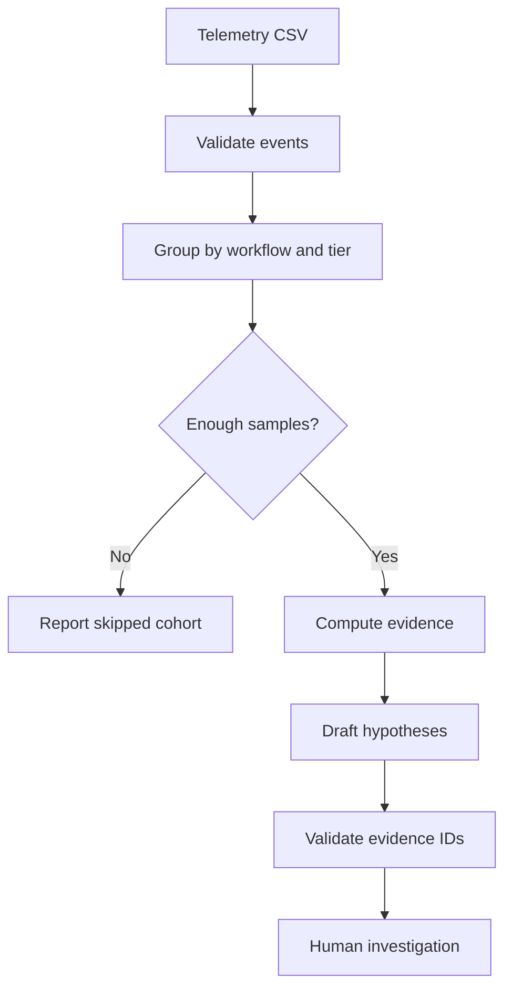

# AI Incident Copilot

Turn a mobile telemetry comparison into a reviewable incident brief. The copilot
computes the evidence before drafting explanations, so every proposed hypothesis
can be traced to a measured cohort.

## Run it

```bash
python app.py demo
python app.py analyze --events data/events.csv --min-samples 20
python app.py analyze --events data/events.csv --model YOUR_GENERATION_MODEL
```

The fixture contains 320 synthetic events. It deliberately regresses editor-open
on budget devices while leaving the other cohorts stable. The demo reports
**+43.03% p95 latency** and **+10 percentage points in failure rate** for that cohort.
These are fixture measurements, not production results.

## Implemented

- Strict CSV ingestion with duplicate and nonfinite-duration rejection.
- Baseline/current comparisons within workflow and device-tier cohorts.
- Explicit sample-count gates and linearly interpolated p95.
- Separate relative latency change and absolute error-rate percentage points.
- Stable evidence IDs, an inspectable workflow trace, and review-required output.
- Optional LLM hypotheses that must reference valid affected-cohort evidence.

## Architecture



## Boundaries

The +20% latency and +5 percentage-point error thresholds are configurable-in-code
heuristics, not statistical significance tests. Matched tiers reduce one source
of confounding; they do not control geography, release adoption, network quality,
or changing workloads. There is no causal attribution, observability connector,
rollback execution, or ticket creation. Raw session IDs are excluded from model
input, but aggregate evidence still needs a real deployment's data policy.

## Verification and scope

```bash
python -m unittest discover -s tests -v
```

Python 3.11+ is required. Runtime and tests use only the standard library.
GitHub Actions is configured for Python 3.11, 3.12 and 3.13; only Python 3.12
was executed during preparation. See [validation](docs/validation.md) and
[recorded demo output](docs/demo-output.json).

The default demo is deterministic and uses synthetic data. The optional Ollama
adapter follows the [generation API](https://docs.ollama.com/api/generate) and
[embedding API](https://docs.ollama.com/api/embed). Adapter contract tests use mock
responses. No live model, cloud service or paid provider was tested. Replace
model placeholders with models already installed in your local Ollama server.

This is a focused reference implementation prepared with AI assistance. It does
not claim production deployment, measured business impact, or enterprise readiness.
Read the [architecture decisions](docs/architecture.md) and
[interview walkthrough](docs/interview.md) before presenting it.
